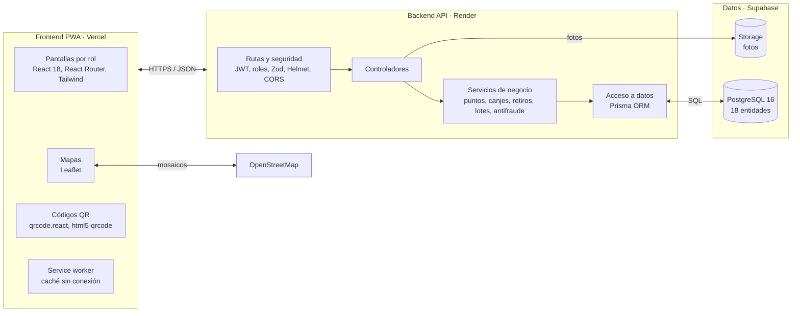
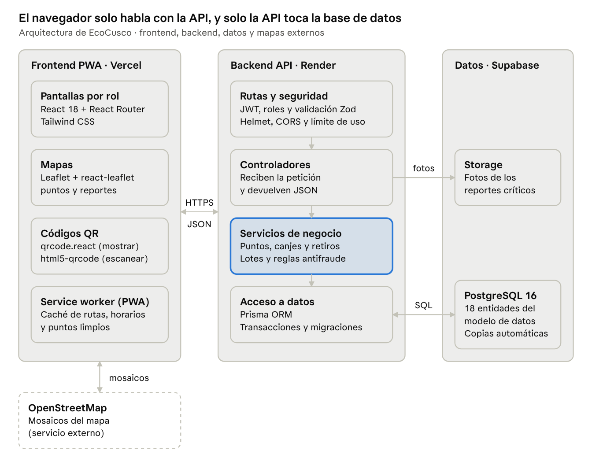

# Diagrama de arquitectura

```mermaid
flowchart LR
    subgraph FE["Frontend PWA · Vercel"]
        UI["Pantallas por rol<br/>React 18, React Router, Tailwind"]
        MAP["Mapas<br/>Leaflet"]
        QR["Códigos QR<br/>qrcode.react, html5-qrcode"]
        SW["Service worker<br/>caché sin conexión"]
    end
    subgraph BE["Backend API · Render"]
        R["Rutas y seguridad<br/>JWT, roles, Zod, Helmet, CORS"] --> C["Controladores"]
        C --> S["Servicios de negocio<br/>puntos, canjes, retiros, lotes, antifraude"]
        S --> D["Acceso a datos<br/>Prisma ORM"]
    end
    subgraph DB["Datos · Supabase"]
        ST[("Storage<br/>fotos")]
        PG[("PostgreSQL 16<br/>18 entidades")]
    end
    OSM["OpenStreetMap"]
    FE <-->|HTTPS / JSON| BE
    C -->|fotos| ST
    D <-->|SQL| PG
    MAP <-->|mosaicos| OSM
```

